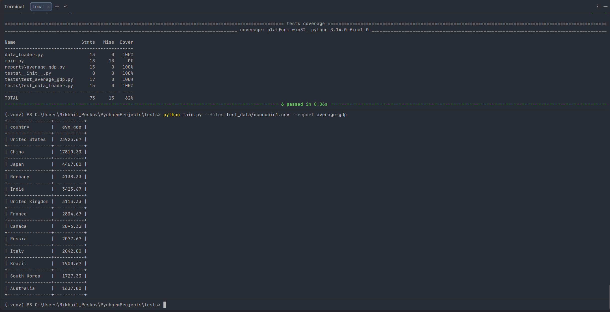

# CSV Files Processing

Обработка CSV файлов с генерацией отчетов.

## Запуск

Обработка файлов:
python main.py --files test_data/economic1.csv --report average-gdp

Тесты:
pytest --cov=.

Новый отчет: создайте .py файл в reports/
